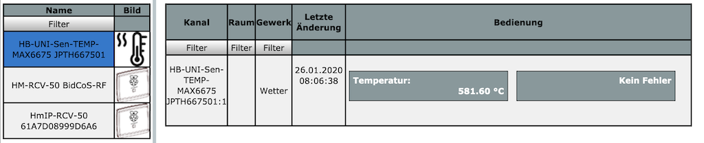
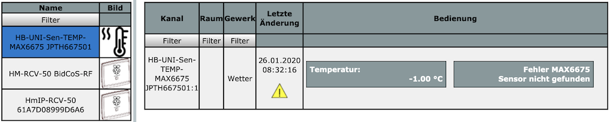
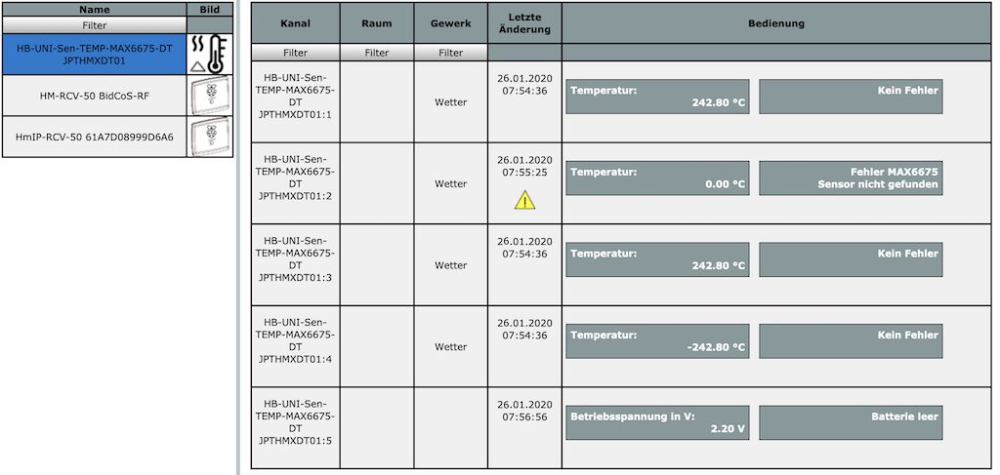
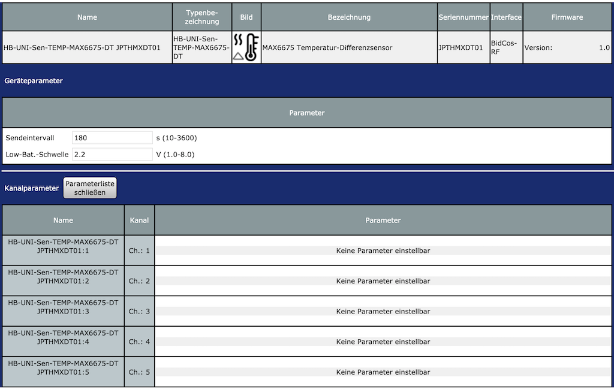

# HB-UNI-Sen-TEMP-MAX6675

#### Temperatursensor 0 ... 1024 °C 
Bezugsquelle: https://de.aliexpress.com/item/32850697464.html

#### Einsatzmöglichkeiten
- einfacher Temperatursensor [HB-UNI-Sen-TEMP-MAX6675](https://github.com/jp112sdl/HB-UNI-Sen-TEMP-MAX6675/tree/master/HB-UNI-Sen-TEMP-MAX6675) 

  - mit Sensor-Fehler-Erkennung:
  

- Temperaturdifferenzsensor [HB-UNI-Sen-TEMP-MAX6675-DT](https://github.com/jp112sdl/HB-UNI-Sen-TEMP-MAX6675/tree/master/HB-UNI-Sen-TEMP-MAX6675-DT)

  - mit Sensor-Fehler-Erkennung
  

  - Fehleranzeige in den Servicemeldungen:
  

  - Einstellungen
  

